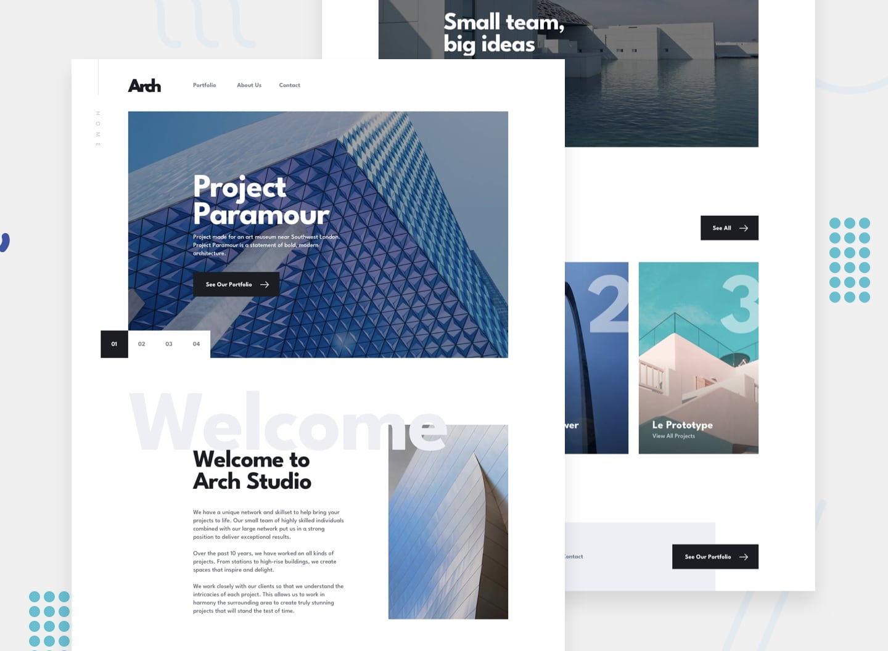

# Frontend Mentor - Arch studio site

This is a challenge from [Frontend Mentor](https://www.frontendmentor.io/). Coded by [me](https://www.frontendmentor.io/profile/Martin-K-Kamir)! 😁

Welcome to the repository for this project. Feel free to look around and explore! 😀

### Tools

- [React](https://reactjs.org/)
- [SCSS](https://sass-lang.com/)

### Development
For the development, I chose my usual stack, which is SCSS and React(CRA). For styling, I used the [CUBE](https://cube.fyi/) methodology with my SCSS utility & CSS variables generator, which I have been working on. I found it to be very powerful with CUBE. The downside of using the generator is creating not necessary utility classes. Soon I will work on making it more optimized. 

### Links

- Live Site URL - [Link](https://archstudio-martin-kamir.netlify.app/)
- My website - [Martin Kamír](https://martinkamir.com/)
- Frontend Mentor - [@Martin-K-Kamir](https://www.frontendmentor.io/profile/Martin-K-Kamir)
- Frontend Mentor Solution - [Solution link](https://www.frontendmentor.io/solutions/arch-studio-site-created-with-react-and-scss-bsV8ooK0-f)

Happy coding! 😄